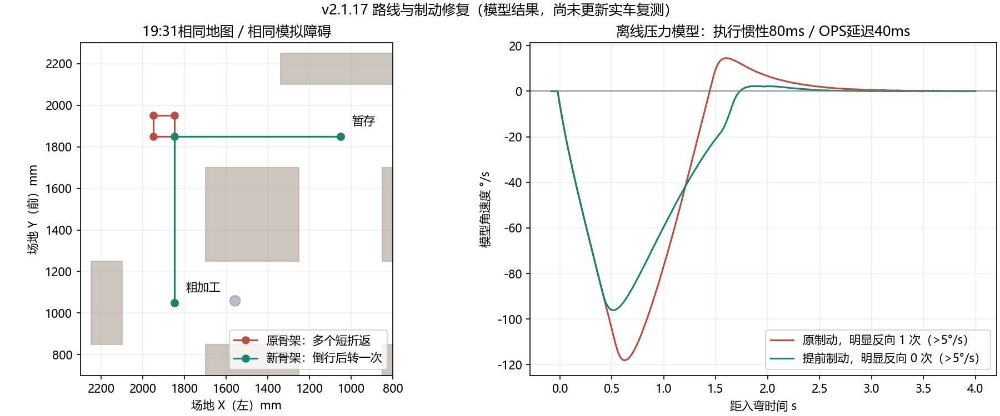

# v2.1.17：避障倒行路线与绕轮提前制动

本次针对19:31实机闭合日志的左上角调头、绕轮出口追角，修改PC路径选择和STM32绕轮控制。日志中的两个圆柱保留为算法模拟障碍，固定禁区、车右塔吊朝向、206×218mm轮心几何及280×260mm碰撞车体均保留。当前通信按用户已更换的JDY-31蓝牙SPP处理。

## 为什么会反复调整航向

有额外模拟障碍时，原比赛规划走`interactive`快捷分支，只比较`MIN_TURN/FORWARD/FIXED`并返回首条安全路线，没有进入支持终点朝向和倒行的用时评分。粗加工→暂存的记录骨架是`(1200,400)→(300,400)→(300,300)→(400,300)→(400,1200)`，长2000mm，模型累计转头约444°。最后一段的行驶航向又与塔吊所需停靠航向相差180°，因此部分“摇摆”是路径主动下发的转头。

两个真正的绕轮弯也有执行问题：目标角首次进入1°范围时，位置仍差约6/12mm，角速度约40°/s；2mm/1°出口条件不能同时满足。实机各过弯约3.13/3.18s，超调约4.23/4.00°，随后进入反向纠偏恢复。

## 本次修改

比赛避障分支统一进入有限时间优化器；优先预演直接和单弯骨架的`GOAL_AWARE/REVERSE/MIN_TURN`策略，按模型用时、累计航向变化和反转次数评分，保留已经通过完整车体扫掠验证的最佳候选。先行候选比较最多0.4s且受每段总预算约束；超时保留安全结果，不宣称连续空间全局最优。地图无额外障碍时，仍按地图、参数、底盘几何和源码签名复用固定路线；改变算法会自动使旧缓存失效，旧文件保留。

同一19:31地图、两个模拟障碍、实机七参数下，新骨架为`(1200,400)→(400,400)→(400,1200)`，长1600mm，沿车尾离站后绕左后轮转一次。终点仍是暂存区LAYOUT270°，保证车右朝作业区。该段模型累计转头约90.6°，模型用时11.54→8.86s；新路线的实际用时尚未测量。

PC与STM32同步提前制动，正常绕轮角速度由`角度=(ω²−ω衔接²)/(2a)+0.32ω`约束。0.32s是设计制动余量，未声称已经标定出实车延迟。保留180°/s²角速度斜坡、非零速度衔接、2mm/1°出口门和最终STOP停稳200ms；错过出口时仍允许严格恢复。没有靠放大到位门限跳过误差。

同一记录的原料→粗加工程序，在80ms执行惯性、40ms OPS延迟的离线压力模型中，绕轮阶段3.40→1.98s，明显角速度反向（绝对值超过5°/s）1→0次。更强的160/60ms延迟仍会有一次恢复，实际延迟、轮胎打滑和OPS偏心需要新日志继续判断。理想无延迟模型的绕轮会更保守：1.20→1.74s。八种角向测试进出弯最低模型车心速度仍约23.77mm/s，未增加进出弯停车等待。

## 更新与验证

重启PC加载v2.1.17，固件更新至`CCAPS 7 2048 3`。所有新关键坐标批次在上传前检查CCAPS7，避免旧控制器与新模型混用；重新规划后运行。蓝牙默认选择“USB / 蓝牙SPP”，使用CRC1完整24通道50Hz；DL-20低带宽模式仍可手动选择。

本次通过6项核心自检、363项无GUI测试、197项真实Qt测试、20项真实C关键坐标测试、16项旧C轨迹测试、命令轴序和桥接检查。另加强真实C延迟模型断言，中等延迟不允许明显反向追角，该专项通过。EIDE编译0错误0警告，Flash80864B、RAM97136B。

重新生成34条新版固定缓存，20次整轮模型完成，含19:31地图两个启停区及有/无模拟障碍的对照。已知无额外障碍的整场缓存加载，在本机测得磁盘78～116ms、内存27～29ms，搜索调用为0；首次冷预计算约27～30s。19:31地图加两个模拟障碍的在线首次规划约12.05s（6次搜索，各段2s预算），不是无障碍固定缓存的加载速度。上述时间仅为本机数据，未外推为Nano速度保证。

规划及PC整轮预演保留10mm车体膨胀裕量；真实C量化回放和惯性压力模型沿用9mm检查场景。两者不可混用为“已验证实车始终具有10mm净距”的结论；运行记录中的OPS也不是外部绝对位置测量。

命名固件：`MDK-ARM/build/STM32F407VET6_ILHC/STM32F407VET6_ILHC_v2.1.17_ADAPTIVE_CCAPS7.hex`，SHA256 `40609bcf45d2ec5628a09f0f8dfa002887844354b78b46ea3772a1418c1688c3`。

本次没有连接串口、烧录、发送运动命令或重启用户正在运行的GUI。保留原始闭合运行文件且复核SHA256。以上运动改善是离线验证，尚未完成更新后的实车复跑；Jetson Nano B01尚未实测。

独立结果：`adaptive_turn_validation_status_20261006.json`、`adaptive_turn_release_20261006.json`、`adaptive_turn_response_20261006.json`；原19:31分析继续保留在`real_run_20261006_193128.md/json`，没有用新模型覆盖历史结论。
