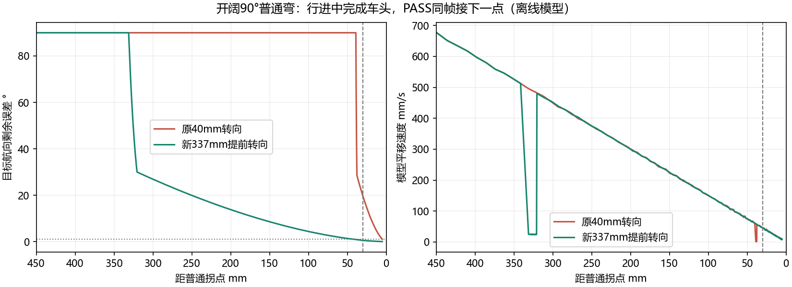

# v2.1.18 普通拐点提前转向与直接衔接

按用户确认的“行进中转好航向，到点直接衔接下一点，不停车”修改普通拐点。绕麦轮的弯仍绕指定轮心，作业站点仍停稳。需要同时更新PC与CCAPS8固件，再重新规划。

## 为什么之前像停车后才转

21:12闭合实机日志 `92ebbeb40d1246c6b9b2962ef2b4d9a3` 使用PC v2.1.17、CCAPS7。普通拐点只在剩余40mm（个别60mm）才切换目标航向；航向误差超过30°时，平移指令降到5%。例如第4点在37.3mm才开始转向，CCTRL平移请求只有2.80mm/s，视觉上接近停住。原普通PASS允许航向差小于30°就切入下一点，可能留下未完成的转向。

v2.1.17的提前制动主要处理绕轮出口超调，没有解决普通拐点的这个时序。数据依据见 [原日志分析](approach_heading_real_20261006.json)，原始四个闭合文件SHA256已复核，没有修改。

## 当前控制行为

- 普通点逐点计算提前转向距离，考虑当前KPX/KPY/KPZ和角速度上限，而非统一40mm。0.2s只是估算余量，不是实测通信延迟。
- 提前距离必须通过完整控制回放、车体扫掠和原500mm连续横移上限。过早转向会碰固定禁区时，依次缩短窗口；预算到期保留已验证路线。本轮最新地图接受的窗口为80mm、337.3mm、77.2mm等，不能把337mm套到所有拐点。
- 新普通点携带 `finish_heading_before_pass` / 旗标64。到位使用原位置门和小于1°航向门；条件满足的同一帧接下一点，没有增加STOP、WAIT或200ms停稳等待。提前转向仍有减速，不能保证巡航匀速。
- 真正绕轮点保持206×218mm轮心几何、指定轮心、原2mm/1°出口门及v2.1.17提前制动。作业STOP、初始/入库前对齐、最终200ms停稳及现有失联保护保留。

空间不足时只能采用较短安全窗口，实车也可能因定位或响应滞后在门前继续纠偏。新程序不以放宽航向门强行通过。

在开阔90°弯模型中，进入最后30mm时航向误差从19.08°降到0.54°。这是离线模型，尚未作为更新后实车表现验证。最新日志同地图完整程序仍23点，模型87.30s完成；见 [模型与逐点窗口](approach_heading_response_20261006.json)。

## 验证与性能

6核心自检、368无GUI测试、197真实Qt测试、21真实C坐标测试（含同帧衔接、8整场、8轮心角向）、16旧C轨迹测试及命令/桥接检查通过。首轮无GUI有一个旧100mm横移预期失败：提前完成站点朝向产生387.7mm短横移收尾，仍低于原生产500mm硬上限；修正该测试适用范围后完整368项复跑通过。首轮失败日志及状态保留，最终无GUI状态独立保存，未将首轮改写为成功。

21个整场模型完成，36个固定缓存文件SHA核验。无额外障碍继续读取固定路线，保留固定禁区；缓存绑定地图、参数、几何和源码签名。此PC磁盘加载87～103ms、内存29～46ms；最新21:12地图磁盘95ms、搜索次数0。冷预计算约27～28s；19:31两模拟障碍场景首次约10.5s。Jetson Nano B01尚未实测，不把PC时间当目标板承诺。

EIDE编译0错误、0警告，Flash80880B、RAM97136B。发布与闭合日志核验见 [最终复核](approach_heading_release_checks_20261006.json)。

## 更新

1. 使用当前PC v2.1.18，重启上位机。
2. 烧录 `MDK-ARM/build/STM32F407VET6_ILHC/STM32F407VET6_ILHC_v2.1.18_APPROACH_CCAPS8.hex`。
3. 确认回读 `CCAPS 8 2048 3`，重新规划后运行；旧固件在批次上传前拒绝。

HEX SHA256：`f483bf7eec67621534052b6873b5fd843a7185ac10121bc643527291b11f3cf9`。点记录尺寸、CRC、既有CPOINT提前距离字段及旧TCAPS1兼容性保留；新批次要求CCAPS8以保证双端使用相同通过门。

本次未烧录、连接串口、驱动车辆或重启用户GUI。JDY-31蓝牙SPP仍使用完整50Hz遥测，DL-20选项保留。下一轮实机运行将继续自动记录，才能判断实际停顿和摆动是否消除。
