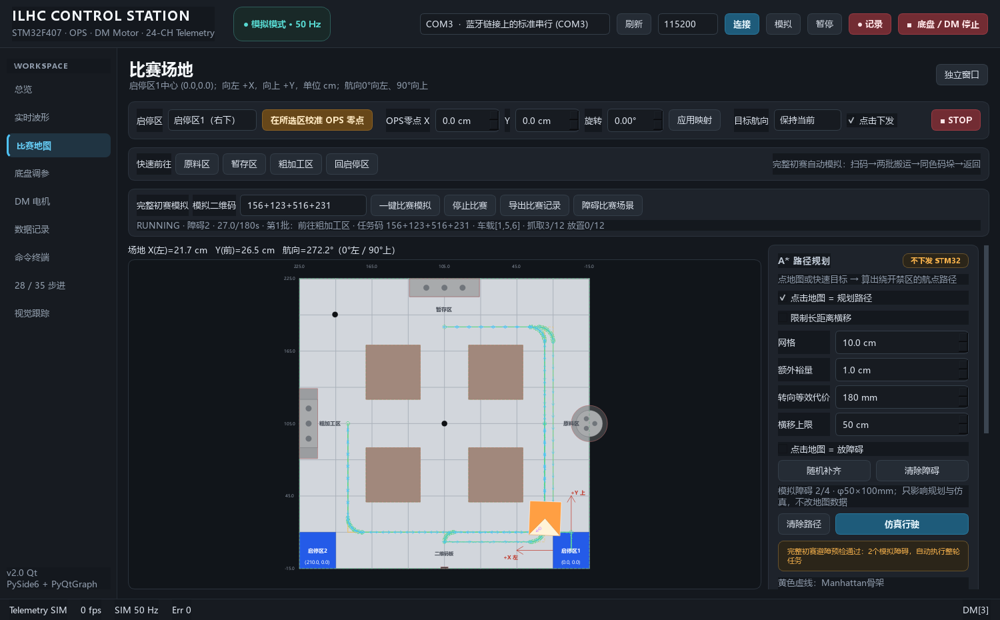

# 比赛静态避障优化（2026-10-03）

用户截图中的两个圆柱按近似LAYOUT_MM坐标`(1200,1200)`和`(297,294)`复现；第二个来自界面FIELD(195.6,195.3)cm换算。中央障碍封住中间通道，但外侧仍存在整车可行路线。旧版在原料→粗加工阶段报平滑fallback，不能因此判定物理通路不存在。

## 原因和修复

- **固定车道节点缺少交点。** 旧版只有17个配置节点，遗漏`(400,2030)`等外侧转弯连接；现在补齐配置横纵车道交点，并逐段用实际航向矩形扫掠筛选。第一层搜索失败后，按圆柱半径、矩形车体尺寸和裕量添加偏移平行线；新增节点、直线和圆弧都必须通过原安全检查。
- **等价折线耗尽预算。** 旧版搜索直到终点才合并共线点，多种相同折线重复展开。现在使用Manhattan启发式A*，入队前合并同向直线并去重；只为实际展开的转弯做120→60mm检查，缓存转弯结果。有限预算内保留不同前缀候选，全路径仍重新做圆弧裁剪、Trajectory及实际控制预演；预算用尽不能声称物理通路不存在。
- **真实跟踪切内。** 旧版直接朝100mm前视点走弦，并追前视Yaw，导致提前旋转和偏向弯内。`(1200,2030)→(2100,2030)→(2100,400)→(1200,400)`规划几何安全，旧控制器实际扫掠却碰到黄色区域。现在保留100mm参考X/Y/unwrap Yaw，用当前实际投影处的几何增量、切线/曲率前馈及投影误差反馈控制；前视窗口提前按小圆弧限速。实际进度仍来自车辆位置，不能按帧数推进，也不在中间样本停车。
- **停车区残余角度。** 旧版90°旋转可能在剩余约0.044°时达到10帧停稳门，随后固定车头平移被正确拒绝。现在进入停稳门之前消除小角度残差，再累积10个停稳帧；没有放宽平移/旋转分离要求。
- **真正封路时耗时。** 搜索前先检查图连通性，避免枚举起点一侧的大量循环路径。图构建、搜索、圆弧采样和预演仍持续响应取消；同一轮复用图快照。

## 验证结果

| 场景 | 出发区 | 结果 | 模拟时间 |
| --- | --- | --- | --- |
| 截图近似两个障碍 | 1 | 完成整轮，12抓取/12放置，返回原区 | 141.28秒 |
| 截图近似两个障碍 | 2 | 完成整轮，12抓取/12放置，返回原区 | 148.72秒 |
| 无附加圆柱 | 1 | 完成 | 97.96秒 |
| 4个预设圆柱 | 1 | 完成 | 108.76秒 |

这些是新版PC模型的积分结果，包含出入库、旋转、扫码和逻辑抓放；不是实车比赛计时。前两项启动预检约1.6—2秒，机器负载会影响耗时。旧文档102.2/122.6秒是优化前的历史数据。

截图场景从两个启停区逐帧核对实际矩形姿态和相邻运动扫掠，完整包含在drivable区域且不碰固定/模拟障碍。中心坐标改为`(1188,1210)`、角上改为`(294,297)`也完成，避免只对一个精确坐标有效。

另用空场4个圆柱挡住所有原始车道，验证新增偏移车道能找到经真实控制预演的连续路线；原几何安全而控制切内的路段现在完成，横向误差小于0.5mm。真正封住全部纵向通道的三圆柱用例约0.5秒明确拒绝。非法障碍、站点占用、实际碰撞、STOP、地图和障碍变化、过期定位及作业故障门禁保持有效。

新增4项无GUI比赛测试、2项无GUI跟踪测试及1项真实Qt整轮按钮测试。完整`python run_tests.py --qt`通过：**6组核心自检、212项无GUI、113项Qt**；[完整回归日志](avoidance_optimization_regression_20261003.log)、[模拟结果与搜索统计](avoidance_optimization_results_20261003.json)。

## 使用

重新启动上位机，让当前运行进程加载修改后的算法。进入PC模拟和比赛地图，重新放置两个障碍并点“一键比赛模拟”。GUI继续显示整轮骨架、平滑路线、参考和实际轨迹，导出JSON中的每个route新增`search`统计，包括是否用了偏移车道、展开状态数、实际预演候选数和图节点数。

圆弧仍只尝试120、110、100、90、80、70、60mm；失败保留明确fallback，不强行平滑。真实280×260mm矩形车体和用户裕量、完整可行驶区域包含检查、固定/模拟障碍、全轨迹复检以及每20ms实际扫掠均保留。没有引入动态障碍、雷达或STM32接入，固件和协议未修改。
