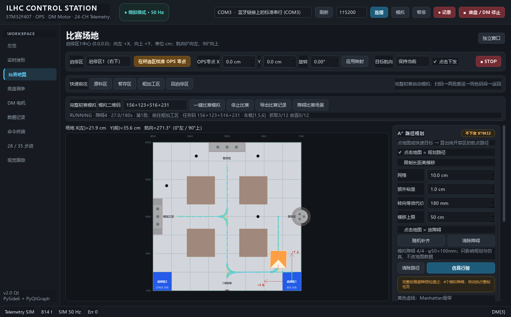
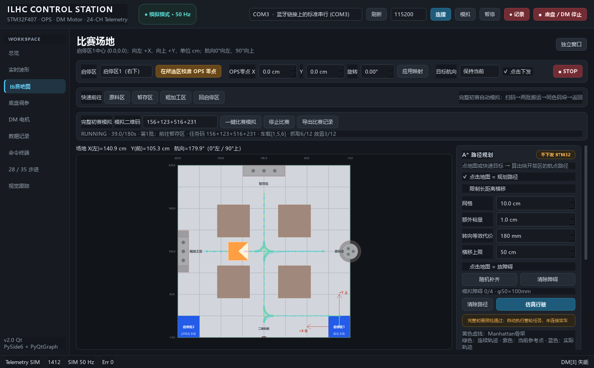

# 完整初赛流程路径模拟（2026-10-03）

比赛地图新增“完整初赛模拟”栏，配置模拟二维码后点击“一键比赛模拟”，自动完成启动、扫码、两批搬运和返回原启停区。使用静态赛场，不接动态障碍、雷达、STM32或机械执行器。

2026-10-03补充静态模拟障碍：点“障碍比赛场景”载入初赛地图与4个φ50×100mm圆柱演示障碍，再点“一键比赛模拟”。中央障碍会迫使原料→粗加工路线绕行。启动时保留手动放置/随机补齐的障碍，整轮规划、圆弧/Trajectory检查、真实控制器预演、出入库/原地旋转和运行每步矩形扫掠使用同一份冻结障碍快照。地图显示黑色圆柱和避障路线，比赛栏显示障碍数量。

预设坐标采用LAYOUT_MM：`(1200,1700)、(220,700)、(220,1700)、(700,220)`。它们是可复现PC演示数据，不是比赛现场坐标。可清除预设后勾选“点击地图 = 放障碍”或“随机补齐”，最多4个；没有障碍时仍允许无障碍比赛。随机障碍可能封路或占据工作站，不保证任意摆放都有连续可行路径。

非法障碍、启停区/工作站被占用或车道图无法找到安全连续路线均明确拒绝整轮启动，保留障碍且不复位/移动车辆、不强行平滑。改变障碍立即取消预检或比赛，包括作业中的抓放计数；绕过界面直接修改障碍列表，也会在下一积分步提交运动前被快照门禁拒绝。障碍变化后需再次明确启动。

比赛JSON新增`match.sim_obstacles`、`obstacle_frame_id=LAYOUT_MM`、`obstacle_radius_mm=25`、`obstacle_height_mm=100`，固定地图快照保持独立，不重复合并圆柱；导出包含实际避障轨迹和阶段结果。

## 比赛文档依据

读取本机两份2027官方文件及其文本转录：

- [竞赛命题与运行](E:/STM32/ILHC/2027年第十届中国大学生工程实践与创新能力大赛智能+工程创新赛道竞赛命题与运行.pdf)：第3—4页场地与设备尺寸，第6页任务编码，第7—8页一键启动、两批搬运、同色码垛及回到抽签出发区。
- [评分与规则](E:/STM32/ILHC/2027年第十届中国大学生工程实践与创新能力大赛智能+工程创新赛道评分与规则.pdf)：第2—3页抓取/放置统计、每轮调试3分钟及运行3分钟、一键启动、停止运行15秒规则（等待转盘增加8秒）、车体投影只能在车道内。

实现的是文档明确的**初赛**。决赛任务及场地现场公布，未臆造精加工、成品或装配流程。准备阶段由用户选择启停区与模拟二维码；一键启动后无需人工逐站确认。未额外模拟3分钟调试倒计时、裁判广播或转盘物理运动。

## 一轮任务

1. 启停区准备并安全出库。
2. 前往二维码板，停稳后模拟扫码，显示任务码。
3. 第一批：原料区依次抓取3件并逐件放入车载仓 → 粗加工区按规定顺序放置3件 → 全部放好后按规定顺序取回 → 暂存区按第一批位置平放3件。
4. 第二批：原料区依次抓取3件并放入车载仓 → 粗加工区按第四组位置依次放置和取回 → 暂存区按同色第一层位置逐件码垛。
5. 返回抽签选定的原启停区并停稳，核对库存和显示统计。

默认任务码为文档示例`156+123+516+231`。颜色编号为1红、2黄、3蓝、4绿、5黑、6浅蓝。

| 批次 | 取料顺序 | 粗加工位置 | 暂存位置 |
| --- | --- | --- | --- |
| 第一批 | 1、5、6 | 1、2、3 | 1、2、3 |
| 第二批 | 5、1、6 | 2、3、1 | **2、1、3** |

第四组只规定第二批粗加工位置。第二批暂存位置通过“颜色→第一批暂存环”映射获得，不能直接套用第四组。任务码校验两批包含相同三种不同颜色，位置组均为1/2/3排列。

正常完成统计为12次正确抓取（原料6次、粗加工取回6次）和12次正确放置（粗加工6次、暂存6次）。每次机械作业默认模拟0.5秒，提交动作成功后才更新库存和统计；车载仓容量3件，跨区运行前必须已入仓。扫码和抓放是逻辑模拟，没有相机识别结果、机械臂反馈或真实比赛得分。

## 路径与车体

新增`competition_map.json`作为独立的初赛名义场景，原`navigation_map.json`保留。依据第3页示意图采用2400×2400mm边界、四个450×450mm禁行黄色区域和中间400mm车道。按正文把原料圆盘设为直径300mm、粗加工和暂存设备设为580×150mm。

场景的`competition.start_zones/staging/stations/lane_nodes`可编辑停靠点及车道图。当前二维码、取料和放料停靠点是PC演示接近位置；设备摆放和机构取料距离没有被声明为现场标定数据，`geometry_verified=false`。固定设备及黄色区域都参与完整矩形车体检查。

区间路线在静态车道图搜索Manhattan骨架，保留完整动作/Corner定义，再复用120→60mm圆弧平滑、20mmTrajectory生成及整车复检。启动前还用生产模拟器预演每条路线，检查100mm lookahead切内偏差带来的**实际**车体扫掠。几何安全而控制器实际碰撞的候选也会被拒绝，继续尝试其他路线；无安全候选明确fallback，整轮不发车。

狭小启停区不能任意旋转：先用保持车头的显式麦轮横移/直移到安全停车区，再对齐连续路线起始切线。返程逆序入库，回到准确启停区中心。工作站的航向切换也在停稳后显式检查旋转扫掠。这些出入库/停车区动作独立标为MANEUVER，不伪造切线Trajectory或强行平滑。区间仍由现有50Hz连续控制器跟踪，中间20mm样本不停车。

地图显示整轮骨架、连续平滑路线与方向箭头、当前参考姿态、实际车辆轨迹。实际轨迹缓冲扩至190秒容量，默认可保留整轮。右侧列出完整阶段表，比赛栏显示当前阶段、任务码、车载仓、抓取/放置次数和180秒时钟。

## 状态机与停止

`competition_simulation.CompetitionRunner`状态为READY/RUNNING/ACTION/COMPLETE/CANCELLED/FAULT。每个运动阶段绑定独立epoch/goal_id，停车区动作和区间末端均核对真实位置、航向及10个新积分帧的停稳条件。作业仅消耗新模拟帧，重复GUI轮询不推进时间或计数。

每轮180秒限制覆盖全部出入库、行驶、旋转、扫码与作业；单个作业超过15秒停止。未加入等待转盘阶段，故不模拟额外8秒例外。正常每个工作区的扫码或抓放时间均远小于15秒。

STOP、停止比赛、清路径、重规划、地图版本/几何、任务码、启停区、参数/标定、链路变化会取消预检或运行。预检在后台，取消事件贯穿搜索与控制器预演；迟到结果不发车。运行中的取消同步清除core控制器和参考点，作业阶段也不能继续抓放或计数。

缺料、车载顺序错误、粗加工环被占用/颜色错误、第一层缺失或不同色、作业期间底盘移动、伪造到位、运动接管、轮失能、过期定位、实际碰撞及超时均停止。最终COMPLETE额外检查车载仓/粗加工区已空、三个暂存环各两层同色以及12/12统计一致。

## 操作与记录

运行`python main.py --simulate`，进入“比赛地图”：

1. 选择启停区1或2，输入模拟任务码；需要避障时点“障碍比赛场景”，也可通过右侧手动放置/随机补齐/清除障碍。
2. 点“一键比赛模拟”。保留地图上的静态模拟障碍，整轮避障预检通过后，PC模拟车复位到所选启停区并自动完成任务。
3. 用“停止比赛”或STOP随时取消；新的轮次需再次明确启动。
4. 点“导出比赛记录”，保存各阶段的骨架、圆弧、Trajectory、地图快照、任务码、库存、统计、时间线及实际FIELD轨迹。记录明确`hardware_ready=false`。

## 验证

默认任务码从两个启停区都约**102.2秒**完成，准确返回各自中心；12次抓取/12次放置，暂存库存为1号环红/红、2号环黑/黑、3号环浅蓝/浅蓝。时间由PC运动学与0.5秒作业模型计算。

4个预设障碍从两个启停区均约**122.6秒**完成（精确积分时间122.62秒）；全轮每个实际矩形位姿及相邻运动扫掠均安全，12次抓取/12次放置及同色双层库存正确。中央障碍使原料→粗加工原1630mm直线路线改为长于2630mm的连续绕行。新增6项无GUI障碍专项和5项真实Qt测试，覆盖两个启停区整轮、确实绕行、独立快照/导出、非法障碍、占用启停区/工作站、封路fallback、实际碰撞注入、手动/随机障碍保留、预检/运行/作业中障碍变更取消，以及绕过GUI修改障碍列表的门禁。

带障碍功能的完整`python run_tests.py --qt`通过：**6组核心自检、206项无GUI、112项Qt**。[带障碍比赛回归日志](competition_obstacles_regression_20261003.log)。生产代码未改固件或通信协议，未连接STM32。

新增15项专项测试及3项真实离屏Qt测试，覆盖两个启停区整轮每步矩形扫掠、任务顺序、同色码垛映射、扫码显示时机、重复帧、单轮只能启动一次、运动/作业中STOP和版本变化、缺料/错误第一层、180秒/15秒超时、伪造到位、作业位姿漂移、非法停靠点、过大裕量、预检取消及实际控制偏差拒绝。Qt测试点击真实一键按钮，验证全轮显示和真实JSON导出，拒绝实车链路。

完整`python run_tests.py --qt`通过：6组核心自检、200项无GUI、107项Qt。[回归日志](competition_regression_20261003.log)。最终回归包含预检输入深拷贝和地图侧栏滚动布局修订。固件和通信协议未改，未连接STM32。
