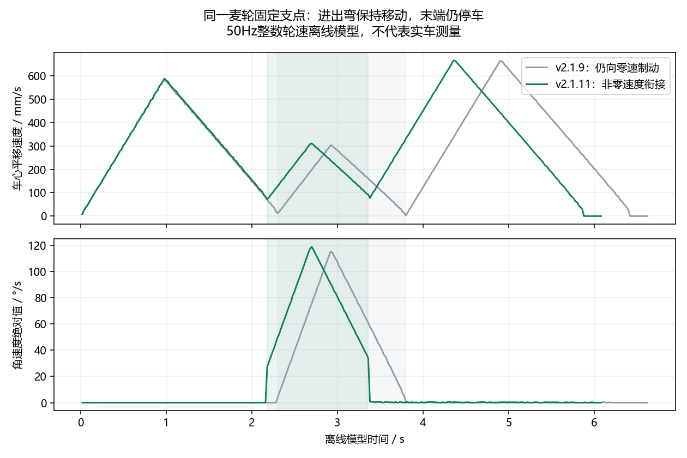

# v2.1.11：保持移动的麦轮支点转弯

用户反馈实机仍先停再绕轮旋转。v2.1.9虽删除了进出弯200ms停稳等待，速度边界仍为零：入弯直线按剩余距离制动至零，绕轮角速度从零启动，出口又制动至零。50Hz下原0.5mm通过范围还可能被一帧越过，使控制器回头纠偏。仅凭截图不能确定当次烧录版本或所有实机停车因素。

## 当前行为

- 入弯直线与绕轮出口采用非零速度边界，车心衔接速度标称80mm/s。平移、旋转限幅和零增益仍生效，低限幅配置可能达不到标称速度。
- 入弯旋转速度由上一周期世界平移速度投影到该轮心圆弧切向得到；不再清零后重新起步。圆心平移与角速度保持同一耦合关系，保留位置反馈、加减速和整数轮速换算。
- 生成的入弯PASS位置门为1mm，出弯PASS为2mm，仍要求实际航向误差小于1°。在同一帧切换目标并立即输出下一段速度，避免越过过小的门后减速、反向纠偏。
- 指定轮心几何仍为前后206mm、左右218mm，旋转臂长212mm。完整车体矩形和连续扫掠仍预演；不能通过的候选保留安全基线。
- 最终入库、任务站点、显式STOP仍停车并检查200ms停稳。实际偏差过大、定位失效、失联或人工STOP仍可能使运动停止。

固定轮心圆弧与相邻直线的切向不同，边界需改变速度方向。本版保持车心移动，并减速完成切换；没有把固定轮心改成自由圆心，也不承诺巡航速度下完全无加速度变化。OPS累计位置偏差需独立标定，本改动没有以入库偏移量补偿定位误差。

## 更新与兼容

PC版本为v2.1.11，能力握手为`CCAPS 5 2048 3`。包含轮心转弯的新批次要求CCAPS5，旧CCAPS1/2/3/4在CBEGIN/CPOINT/TRUN前拒绝，并明确提示更新固件。普通坐标仍要求CCAPS3。轮心点格式3、旗标16+32、30字节CRC、2048点共享64KiB缓存不变。

实机需要烧录本次固件，并重启PC后重新规划、上传路线：

`MDK-ARM/build/STM32F407VET6_ILHC/STM32F407VET6_ILHC.hex`

另存同内容、带版本名的固件，便于区分旧文件：`MDK-ARM/build/STM32F407VET6_ILHC/STM32F407VET6_ILHC_v2.1.11_CCAPS5.hex`，SHA256为`663c0f761482d890a1958b8fca20017497a3e39513916ace3cb47e522118b45c`。

本次未连接串口、烧录、动车或重启用户程序。EIDE工程为MDK-ARM，配置STM32F407VET6_ILHC；构建0错误、0警告，Flash79436字节、RAM97072字节。日志位于根目录`RTOS_APP/validation/moving-wheel-pivot-build-20261006/`。

## 离线证据

相同标准路线，四个外角各两个方向：

| 指标 | v2.1.9 | v2.1.11 |
|---|---:|---:|
| 进出弯10mm范围内最低车心速度 | 2.97mm/s | 71.37mm/s |
| PC整条路线模型时间 | 6.62s | 6.08s |
| PC绕轮阶段最大指定轮心偏移 | 小于2mm | 1.463mm |

真实C控制器与真实麦轮混控、整数RPM、ZDT输出层离线回放的八角最低边界速度也为71.37mm/s，最大轮心偏移1.464～1.475mm；整段含上传和初始停车为7.34s。均验证整车连续扫掠、最终STOP，不能当作实车速度或误差。

复现：运行`Docs/audit_moving_wheel_pivot_20261006.py`生成八角程序、响应JSON及速度图。`tests/test_pivot_turns.py`和真实C的`Tests/hardware/test_coordinate_batch.py`均加入基于实际整数轮速位移的边界最低速度检查，不再只看是否发停车动作。后台串行验证脚本为`Docs/run_moving_wheel_pivot_validation_20261006.py`，各进程状态及退出码保存于`moving_wheel_pivot_background_status_20261006.json`。

最终串行回归全部退出0：核心自检与327项无GUI回归、57项真实Qt入口回归、18项真实C坐标执行器回归、16项旧轨迹C回归及桥接/参数/RTOS/坐标链脚本。真实C八组全场均完成，含两启停区与0/1/4/2障碍场景。Python编译、结果路径检查和Git diff-check通过。首轮能力号专项发现上传器接受集合遗漏5，补齐后重新通过专项和全套；没有用旧日志替代本次结果。
