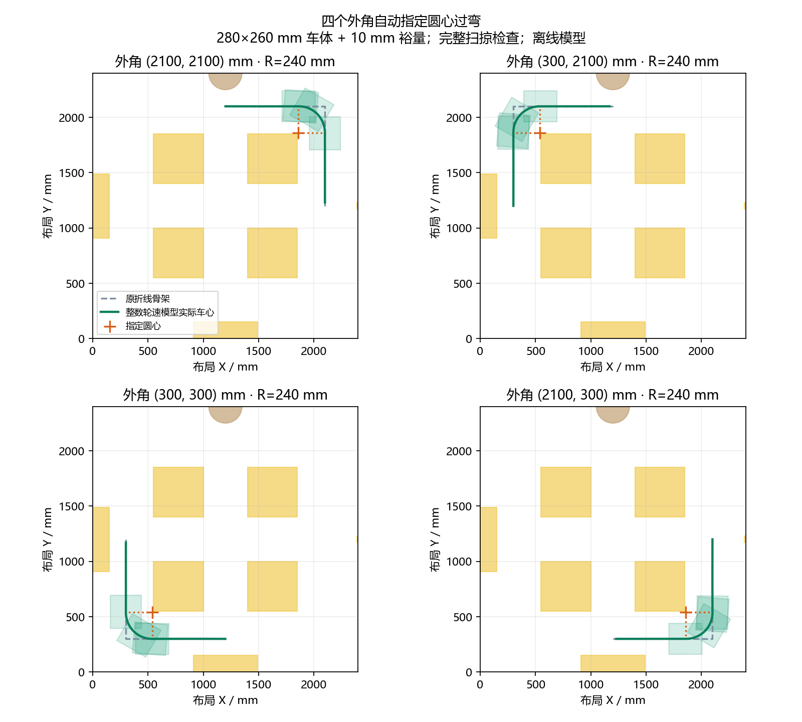

# v2.1.8 指定圆心过弯

> 本文记录开发中间方案。用户随后澄清要求绕麦轮支点旋转，并给出实际轮心尺寸；最终实现、图和更新要求见 [麦轮支点转弯](WHEEL_PIVOT_TURNS_20261006.md)。本文的240mm切弯方案、CCAPS2和旧构建数据不代表当前版本。

宽敞外角现在自动尝试指定圆心过弯。小车的车心沿圆弧移动，车头随转角旋转，直线进出弯相切；这不是停在原拐点原地转头。模拟器与 STM32 关键坐标执行器均已接入。

## 选择与执行

- 在已有安全坐标路线的直角弯上，尝试半径 240、200、160、120、80 mm。前后直线须容纳进出弯，车头策略须与几何转角一致；不能把任意侧移折弯强行改成圆弧。
- 当前地图四个外角优先使用经过验证的圆心方案，允许比原方案慢；其他拐角只有完整模型更快才替换。理想矩形连续圆弧扫掠、50 Hz 实际整数轮速响应扫掠均须通过。黄区、设备、边界、动态障碍、原七参数与横移限制仍参与检查。
- 圆心候选最多占用额外 0.75 秒，并受原规划总预算和取消信号约束。半径不适合、控制预演失败或预算用尽，保留已经验证的原坐标方案。STOP/地图/参数/连接改变的取消不能返回旧结果。
- 入弯和出弯航向误差须小于 1°，出弯位置门限最多 2 mm；不会沿用普通 PASS 的 30°放行门。STM32 按实际航向推进圆弧相位，叠加位置纠偏，耦合平移与角速度限幅。角速度变化率为 180°/s²。末点 STOP 保持实际位置、航向和 200 ms 停稳要求。
- 地图新增橙色圆心与半径线，绿色线显示完整控制响应。点击、回库、整场路线共享选择入口；圆心标记也接入整场模拟和实机批次预览。台账注明圆心、半径、角度与实际扫掠结果。
- 插入圆心方案后不再沿用原骨架的最优性结论。保留原骨架证明记录，但新结果 `optimality.proven=false`，不声称连续路线最优或最快。

## 四角结果

布局坐标的四个折点为 `(2100,2100)`、`(300,2100)`、`(300,300)`、`(2100,300)` mm。每处两个方向共八条自动点击路线，当前地图及默认 280×260 mm 车体、10 mm 裕量均选到 240 mm 半径。

图中橙色十字为圆心，虚线为原折线骨架，绿色为整数轮速模型实际车心，透明矩形包含车体和 10 mm 裕量。圆心属于几何参考点，本身不需要位于车辆可通行区域。

| 比较 | 模型时间 |
| --- | --- |
| 相同自动快速点击入口，关闭圆心后选出的安全方案 | 5.74 s |
| 自动圆心方案，八条均完成末端 STOP | 7.62 s |
| 手动构造相同骨架、比较原控制设置得到的安全基线 | 4.88 s |

本次没有提速承诺。严格进出弯姿态和角速度斜坡增加了时间。真实 C 执行器加整数电机模型的八条圆心路线全部 DONE，最大径向误差 1.304～1.324 mm，计时含初始上传与停车窗口。以上不是实车测量，尚未纳入全部电机动态、打滑和 OPS 延迟。

复现图与八条自动方案：`python Docs/audit_pivot_turns_20261006.py`。数据见 [JSON](pivot_four_corners_20261006.json)，每条含关键坐标程序和控制响应。

## PC 与固件更新

本轮需要双端更新：重启 v2.1.8 PC，烧录本次 HEX。

固件工程为 `MDK-ARM`，配置 `STM32F407VET6_ILHC`，构建目录 `MDK-ARM/build/STM32F407VET6_ILHC`。产物：`STM32F407VET6_ILHC.hex`。最终 EIDE 编译 0 错误、0 警告，Flash 78164 B，RAM 97064 B。

指定圆心的 PC 程序使用 schema 3，以免旧程序把圆弧当作直线。STM32 `CCAPS 2 2048 3` 支持新格式；新 `CBEGIN` 在七参数后追加 `,2`，`CPOINT` 追加两个 OPS 圆心坐标，旗标 `16` 表示该目标的入段是圆弧。CRC 包含圆心，线格式点记录为 30 字节，内部每条 32 字节，2048 条仍与旧轨迹共用 64 KiB。旧密集轨迹 `TCAPS 1` 和普通坐标 22 字节 CRC 保持兼容。

未含圆心的批次仍发送旧坐标格式；含圆心批次遇到 CCAPS1 会在发送 CBEGIN/CPOINT/TRUN 前拒绝并提示升级，不能降成直线。圆心范围、半径、转角、端点几何和弧长都由固件验证。

新 CPOINT 合法最长文本为 91 字节；带七参数的 CBEGIN 批次头可达 106 字节。串口行缓冲已从 96 扩到 128 字节；两种真实 USART 分包接收验证通过，超长整行仍丢弃并取消。

## 本轮验证

- 6 组核心自检、324 项原完整无 GUI 测试通过；新增自动规划八方向测试后，8 项圆心逻辑专项全部通过（覆盖的无 GUI 唯一用例共 325 项）。
- 191 项真实 offscreen Qt 分组覆盖通过：全套首次 190 项通过，1 项旧“无圆弧”断言与新功能不符；更新测试后通过跟踪完成、schema 3 导出及圆心数量检查。该全套日志进程返回 1，不能称为全套单进程全绿。
- 15 项真实 C 坐标整组通过，包括八轮整场、四角八方向、旧参数/取消/失效保护；追加 2 项新协议专项通过，包括 35°、-170°、90°映射与非默认参数、圆弧末端 STOP、圆心 CRC 和几何拒绝。
- 16 项旧 C 轨迹、桥接、参数协议、参数集成/回读、RTOS 与坐标链脚本通过；扩容后的真实 USART 接收、发送/PC CRC 解析、命令轴序、RTOS 脚本直接执行通过。Python 3.13 用 unittest 调用只有脚本断言的模块会报“0 tests”，因此最后采用脚本直接运行，不将该包装器退出 1 当作通过。
- Python 编译及源码差异空白检查通过。

主要日志：`pivot_headless_initial_20261006.log`、`pivot_qt_full_20261006.log`、`pivot_additional_final_20261006.log`；固件日志在 `RTOS_APP/validation/pivot-coordinate-c-initial-20261006.log`、`pivot-protocol-final-20261006.log`、`pivot-legacy-regression-20261006.log`、`pivot-rx-scripts-final-20261006.log` 与 `pivot-build-final-20261006`。

本轮没有连接串口、烧录、驱动实车或重启用户正在运行的程序。
