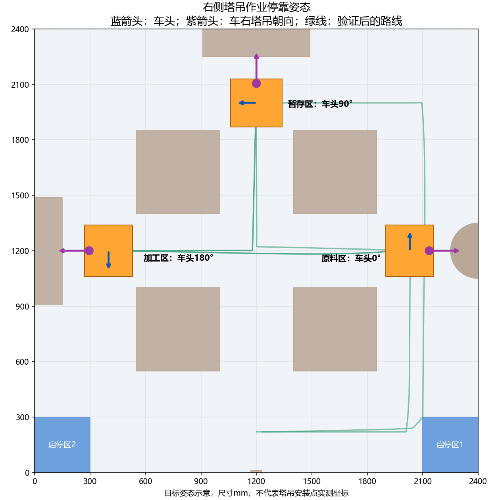

# v2.1.13 右侧塔吊朝向与固定路线

塔吊装在车身右侧，收拢后不超出原280×260mm碰撞矩形。作业点现在同时约束位置和车头航向：把从停靠点指向作业区中心的方向作为车右方向，再计算车头角。普通地图点击仍使用所选航向；作业区快捷目标与配置中的作业停靠点采用塔吊朝向约束。

| 作业区 | 界面车头角（0°上、90°左） | 车身右侧朝向 |
| --- | --- | --- |
| 原料区 | 0° | 场地右侧原料圆盘 |
| 粗加工区 | 180° | 场地左侧加工设备 |
| 暂存区 | 90° | 场地上侧暂存设备 |

这是当前地图的结果，不是写死的三个角。`competition.stations`配置停靠点，`competition.work_areas`配置对应设备中心；修改后重新计算。内部LAYOUT角分别为180°、0°、270°，请勿直接填成界面角。二维码点和入库航向沿用原规则。



图中紫色表示车右/塔吊方向，蓝色表示车头。机构图标为方向示意，未表示塔吊的实测安装偏心。

坐标规划把作业航向作为到站目标，沿途允许平移与旋转同时进行，绕轮方案仍经过完整车体扫掠验证。作业和最终入库仍要求实际位置/航向到位、停稳200ms。没有用显示角代替到位判断。旧密集轨迹兼容入口在站点加入经过扫掠检查的航向调整；当前界面使用坐标入口。

## 固定路线与速度

“无障碍”按没有额外圆柱或动态障碍处理，保留固定禁区及合法行驶区域。固定路线预先比较规划器有限候选中的安全方案并验证控制响应，保存到`precomputed_routes/*.json.gz`。后续相同配置直接读取，不重新搜索；两批重复路段也复用同一次计算。任务码改变只重建取放动作，不改变站点间路线。

缓存身份包含地图内容、停靠点/设备中心、起终航向、安全裕量、完整七项底盘参数、车体/轮心几何和算法源码内容。地图或参数改变后旧缓存失效；首次缺少对应路线会计算并保存。两个启停区分别准备固定路线。实机七项参数仍以回读为准，和默认参数不同则须为实际参数预计算。

有额外障碍时，先把固定程序对当前场景完整回放；能通过则复用，受阻才搜索，每个新路段默认2秒搜索预算。预算是候选搜索控制，并非整个比赛准备的严格墙钟上限。无安全候选时拒绝运行，不忽略固定禁区或绕过预检。新障碍条件下未比较所有替代路线，结果不宣称最优。

无障碍路线也不宣称连续空间或整场航向组合的数学全局最快。这里固定的是当前地图、参数和有限候选集下预先优化且通过验证的路线。增加必要作业航向后，模型行驶时间可能增长。

加载固定路线之后，提交模拟及编码实机批次仍做控制回放、量化检查和连续扫掠。批次编码复用同批内完全相同的量化程序检查结果；没有删除几何检查。进度中的上传、参数回读、预检和规划搜索是不同阶段。

## Jetson Nano B01 无GUI入口

`planner_cli.py`只规划或输出STM32批次JSON，不连接串口或驱动小车。算法使用CPU，不需要Qt、CUDA或GPU。需要Python3.10或更新版本，以及`requirements-planner.txt`中的NumPy、Shapely2.0和pyserial。

Nano的JetPack4.6.x使用Ubuntu18.04基础环境。建议为规划器单独提供Python3.10环境或容器，保留JetPack系统Python与CUDA组件。依据：[NVIDIA JetPack说明](https://developer.nvidia.com/jetpack-sdk-464)、[Shapely安装说明](https://shapely.readthedocs.io/en/2.0.7/installation.html)、[Python独立环境文档](https://docs.python.org/3.10/library/venv.html)。

在已提供Python3.10的Linux环境中，从`ILHC_Qt_v2`运行：

```sh
python3.10 -m venv .venv-planner
.venv-planner/bin/python -m pip install --only-binary=:all: -r requirements-planner.txt
.venv-planner/bin/python -B planner_cli.py benchmark --map competition_map.json --zone both --batch --output benchmark.json
```

也提供CPU容器配方，需在Nano上实测构建与运行：

```sh
docker build -f Dockerfile.planner -t ilhc-planner:2.1.13 .
docker run --rm -v "$PWD/output:/output" ilhc-planner:2.1.13 benchmark --zone both --batch --output /output/benchmark.json
```

把当前源码、实际地图和相应`precomputed_routes`一起复制到Nano。Windows/Linux换行由源码读取归一化，不会仅因CRLF/LF变化失效。`--cache-dir`或`ILHC_ROUTE_CACHE_DIR`可以指定可写目录；只读部署可读取已附带路线，新增计算仅在进程内复用。

默认界面加载`navigation_map.json`，比赛入口补齐缺少的站点配置并保留其原几何。CLI默认使用`competition_map.json`，两张地图是不同缓存配置，部署时明确指定实际地图。

PC上为实测地图及参数预计算：

```sh
python -B planner_cli.py precompute --map navigation_map.json --zone both --control chassis-control.json --cache-dir precomputed_routes --output precompute.json
python -B planner_cli.py plan --map navigation_map.json --zone 1 --control chassis-control.json --code 156+123+516+231 --batch --output plan.json
python -B planner_cli.py benchmark --map navigation_map.json --zone both --control chassis-control.json --batch --output benchmark.json
```

`chassis-control.json`须完整包含`kpx,kpy,kpz,xyvmax,zvmax,xyvmin,zvmin`，使用底盘实际回读值；不传则使用模型默认值。`--obstacles '[[1200,1200]]'`表示额外圆柱的LAYOUT毫米坐标。`--mapping X Y YAW`为批次的OPS到场地映射。基准输出分别记录磁盘/内存加载、实际搜索调用数、量化预检时间及点数。

本轮只修改PC规划/界面及离线部署入口，沿用v2.1.11/CCAPS5固件。需重启PC加载v2.1.13。没有连接串口、烧录或动车。Nano B01尚未实测，Docker配方尚未在目标板构建；PC计时不能当作Nano性能承诺。

## 本轮离线结果

Windows11、Python3.13.2、NumPy2.2.4、Shapely2.1.2。Nano配方使用独立Python3.10及NumPy1.x/Shapely2.0，目标环境仍须构建验证。测量只包含函数本身，不包含Python冷启动、GUI、串口参数回读与上传。

| 当前地图 | 启停区 | 固定路线磁盘加载 | 内存复用 | 批次量化预检 |
| --- | --- | --- | --- | --- |
| competition_map | 1 | 72.5ms | 25.3ms | 329–334ms |
| competition_map | 2 | 72.6ms | 25.5ms | 330–343ms |
| navigation_map | 1 | 73.6ms | 23.8ms | 324–334ms |
| navigation_map | 2 | 72.9ms | 24.9ms | 323–325ms |

以上八次固定加载均`search_calls=0`。生成固定路线首次计算每区5.54–5.97秒，部署包已附带两地图/两区默认参数的18条有效路段，压缩文件合计354030字节。CLI整数参数与Qt/串口浮点回读的等价数值共用缓存身份。发布清单`precomputed_routes/manifest.json`记录源码版本与每个文件SHA256；测试生成的其他参数缓存不属于发布清单。

两地图/两区的控制模型整场均完成，12抓12放、返回对应库位；单障碍、四障碍、截图两障碍共六场也完成，在线规划函数计时0.73–1.96秒。所有测量为离线模型，不表示实车动作时间或定位误差。记录见`right_crane_release_20261006.json`，复现脚本`audit_right_crane_routes_20261006.py`。

新坐标路径和真实C电机回放检查六次实际作业停靠的车右朝向，未使用参考航向替代实际到位判断。兼容旧轨迹入口补入库前的停车点收敛，并保留极小浮点角误差的反馈，避免多次旋转后的约1e-13°残差被贴边几何判成越界；碰撞边界与停车门限不放宽。

初始测试暴露旧分支局部变量遮蔽、兼容入口贴边精度和测试读取状态消耗回复的问题，修正后完整回归；首轮日志保留`initial`和`before_precision_fix`后缀。最终以`right_crane_validation_status_20261006.json`及其中三组日志退出码为准。

最终完整检查：6项核心自检、335项无GUI、64项真实Qt、18项真实C坐标全部通过。最后缓存整数/浮点身份统一后，再通过13项相关回归及1项真实Qt异步入口检查：禁止调用搜索也能完成路线准备；CLI两区磁盘/内存加载和量化均通过、搜索次数为零。专项日志为`right_crane_cache_final_20261006.log`、`right_crane_qt_cache_entry_final_20261006.log`，命令行结果为`right_crane_cli_final_20261006.json`。
