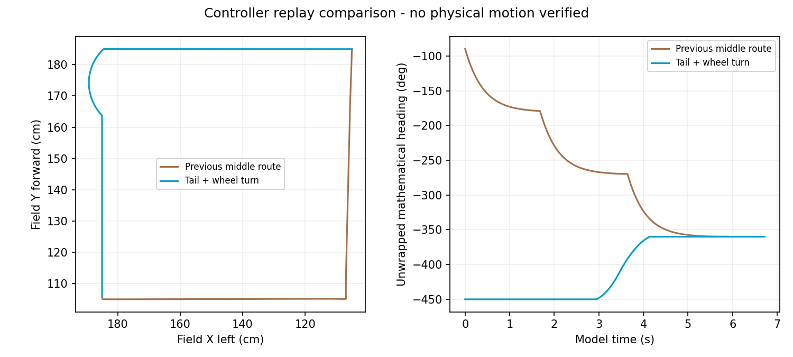

# v2.1.14 倒行路线与自动运行记录

本轮只修改PC。继续使用已有v2.1.11/CCAPS5固件；重启上位机加载v2.1.14。没有连接串口、烧录或驱动车辆。

## 路线优化

粗加工出站不再优先压低“路线长度+折弯次数”而排除倒行。有限车道图候选的几何上限取下界+400mm与已验证安全骨架代价的较大值，对GOAL_AWARE、MIN_TURN、FORWARD、REVERSE、FIXED五种车头策略和九组控制参数进行完整矩形扫掠/整数轮速预演。GOAL_AWARE用终点作业朝向参与各段前进/倒行/短侧移的方向选择。

评分采用模型用时 + 0.015秒/度的累计航向变化与终点残差 + 0.2秒/次明显角速度反向，包含START到首积分帧的转角。按100ms评分档比较，同档优先较短骨架，再比较用时和方向代价，避免毫秒/亚角度差引入25mm往返小折线。四外角仍优先采用安全的指定轮心旋转。绕轮扩展有预算且没有穷举所有组合；不能称全局最短、最快或所有情况下更平稳。完整碰撞裕量、500mm连续横移限制、站点/最终停车条件保留。

默认比赛地图粗加工LAYOUT(1200,400)→暂存(400,1200)：新路线先沿车尾倒行，经外侧(400,400)绕轮，再到暂存；到站车身右侧朝向作业区。旧中间路线模型累计转角约269.71°，新路线约90.49°。保留绕轮后模型6.72秒，旧中间路线5.88秒；减少转向是这次评分取舍，不宣称这段实车提速。此前265.67°统计漏掉约4.04°的首积分周期，本版补齐。

密集预演缓存改为最多30000个轨迹样本/128个结果，避免扩大候选后的1024条密集轨迹缓存占满内存。最多比较12个骨架，首次固定路线每路段默认5秒优化预算，保留已完成安全预演的最佳方案；CLI的`--static-budget`可增加离线预算，预算值不是整场严格墙钟保证。固定路线仍按地图、裕量、七项底盘参数、几何、算法内容绑定；无额外障碍保留固定禁区并复用。参数或地图变化需要新路线；Nano尚未实测，PC计时不是目标板保证。

## 自动记录

当前v2.1.18补充版：连接实机或开启模拟仅绑定记录源，待机不创建日志文件。开始运行才自动记录；跑完、取消或手动STOP后结束，下一次运行新建目录，无需点击原“记录”按钮。比赛地图有“打开运行日志”按钮和当前记录状态提示。默认目录：

`HostTools/ILHC_Debugger/ILHC_Qt_v2/records/runs/`

可用环境变量`ILHC_RUN_LOG_DIR`指定其他目录。每次坐标批次、模拟路径/比赛、手动/直接运动建立独立带时间的REAL/SIM目录，包含`runs/<运行ID>`。正常结束、取消、STOP、接管及连接关闭分别记结束状态，停止接收新日志、排空已入队记录后自动关闭文件。直接命令若没有完成回读，只能记关闭/停止，不能假定成功。旧版本按连接会话持续记录的目录仍兼容分析，不删除；当前机制见 [运行日志生命周期](RUN_SCOPED_LOGGING_20261006.md)。

会话目录包含：

- `session.json`：来源、通道及单位、PC版本、地图、OPS映射、界面偏移输入（明确不是固件偏移回读）、任务码/启停区、碰撞开关。
- `events.jsonl`：原始RX字节、成功/失败TX及实际发送字节、参数回读、固件文字（含TSTAT/CSTALL/CCAPS）、CRC/丢包/定位非法/设备重启统计、批次游标/进度、取消原因、界面提示。
- `telemetry.csv`：设备序号/毫秒时钟、主机接收时间、原始24通道及关联运行ID。
- `runs/<运行ID>/metadata.json、plan.json、telemetry.csv、result.json`：运行快照、完整计划/量化点表/模型预演、实际数据、终止原因及校验触发快照。

记录位于串口/模拟数据源，先于界面队列，因此界面暂停/队列溢出不会停止原始记录。CRC错误、重复帧和定位非法帧保留原始字节与统计，但不混进有效位置CSV。非有限值写为null。后台线程写盘，控制和接收线程只入队；队列上限8192，拥塞丢失有计数/序号空洞，界面提示写盘错误，不以日志故障修改控制命令。每秒刷新文件，关闭有界等待；强制杀进程/磁盘阻塞可能丢失末尾数据，不能声称无损记录。

TX的successful表示整条串口写入完成，不证明MCU接收或开始运行；ACK/TSTAT另有原始记录。写入失败时事件中的字节只能当作尝试内容，实际发出的部分未知。

原24通道没有四轮编码器实测反馈，SpeedTarget0是1号轮目标；devz也不能视为坐标执行器当前目标角的权威回读。日志中OPS是定位系统测量，仍不等于外部测量的真实车身位置。实车摇摆原因尚未证实，本轮没有盲调KPZ或改变固件控制。

## 离线分析与下一次实车反馈

运行后将整个REAL会话目录保留/打包，包含session、events和runs。只截地图或只给CSV会缺少参数、游标、计划及取消原因。

无需连接硬件，命令为：

```powershell
python -B analyze_run.py "records/runs/20261006_…_REAL_…"
# 也可指定其中的runs/<运行ID>目录，只分析该次运行。
```

生成`analysis.json`与各运行的`analysis.csv`，包括OPS速度/角速度、2秒内显著航向反向窗口、站点标签、目标距离、候选航向切换、参数和传输状态。实机优先使用设备tick求导，模拟使用模型时间，避免加速离线回放被误算为真实速度；360°跨越取最短角差，重启/重复tick/超过200ms空窗不跨帧求导。

实际批次的模型按TSTAT路径进度对齐，避免同一区域反复经过时全图最近点匹配到错误路段。模型保存的是预演累计位移，TSTAT是骨架投影进度，因此该对齐和误差仍属近似。目标角仅依据量化点表、当前距离和最近350ms状态重建；绕轮相位、初始停车门、固件内部目标切换时刻没有直接回读，所以标为候选而非实测。只有RUNNING/WAITING/DONE生成目标对照，等待站点使用当前停车点，不能套用下一路段。模拟每帧记录控制参考，分析表明确标为SIM_CONTROLLER_TARGET，其到目标距离不冒充实机模型误差。可疑反向窗口是分析提示，正常修正也可能出现，不能自动判定根因。SIM目录明确标为模拟，不能当实机验证。

重点对照左上角绕轮窗口与暂存区接近/停靠窗口：角度反向是否伴随候选航向切换、位置偏差、CSTALL、参数变化或遥测空窗；随后再决定是否需要航向控制/过渡门修正。

## 验证文件

专项覆盖接收端记录先于界面丢帧、CRC坏包原文、串口短写失败、REAL/SIM与运行隔离、写盘失败、设备时钟回绕/重启、360°角差、按进度模型对照和Qt批次初始STOP不会错误结束日志。完整串行验收见`route_journal_validation_status_20261006.json`及各日志；固定路线和性能见`route_journal_release_20261006.json`。带`memory_interrupted`的首轮文件记录内存问题，中断不当作验收通过。

最终发布18条路线，两地图两区无额外障碍磁盘加载约80–86ms、内存约24–27ms，均search_calls=0；量化预检约293–355ms。首次预计算约27.2–29.2秒/整场，结果固定复用。8次固定路线整场模型与6次有障碍整场均完成，保留12抓/12放/作业朝向/完整车体检查。入库前补齐同角度情况下的精确停车点收敛，防止新返程路线的亚角度残差被固定航向入库动作拒绝。指标来自PC离线，不当实车或Nano证明。

最终四组串行进程均退出0：路线发布审计、6核心自检+347无GUI、193真实Qt、18真实C坐标；最新分析/日志专项10项复测退出0，包含最后增加的WAITING当前站点目标判断。语法兼容Python3.10、当前源码与18条发布文件SHA、Git换行归一化下diff-check通过。首轮内存/预算中断、入库衔接失败以及score_before测试失败文件均保留，不当最终通过。


