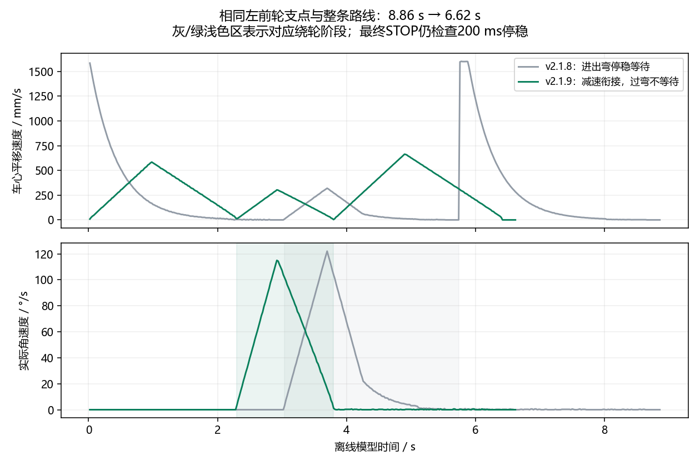
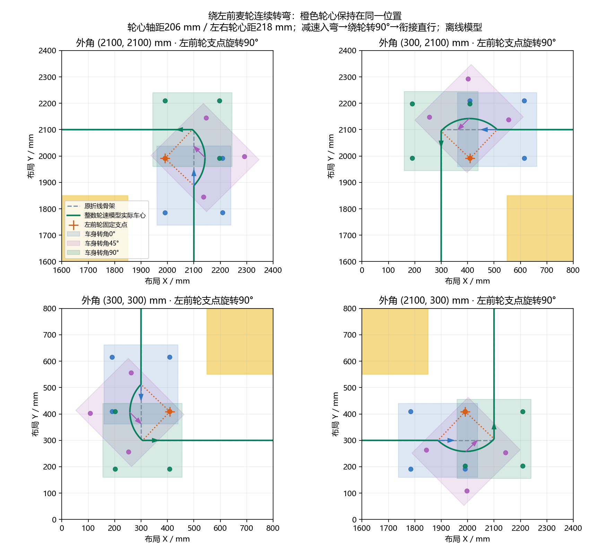

# v2.1.9 连续麦轮支点转弯

用户反馈模拟直角弯停顿较久。v2.1.8 在入弯和出弯各检查 200 ms 停稳，位置/角度比例控制还会接近目标后逐渐降到很低的速度。八个标准角向的回放中，入弯/出弯点 3 mm 内低于 1 mm/s、1°/s 的累计时间为 0.70 s，绕轮阶段约 2.70 s。

本版让两个过弯 PASS 点在实际位置/航向到位后同一控制周期推进，不再等待 200 ms，也不额外发停车动作。通过范围仍为 0.5 mm，轮心仍固定在左/右前轮，倒车对应后轮；最终 STOP 和比赛站点的实际位置、航向、低速与 200 ms 停稳检查保留。

## 速度衔接

只有轮心旋转前后的相邻直线使用有限距离制动曲线，沿线加速度上限 600 mm/s²，并由有效 KPX/KPY 缩减；横向位置纠偏继续用原比例控制。进入绕轮阶段后角速度使用剩余角度制动曲线，角加速度上限 180°/s²，并由 KPZ 缩减。制动曲线留 30% 余量，减轻离散积分导致的越过目标。

相邻直线继承上一周期实际发送的速度进行加减速，绕轮阶段仍通过实际航向计算车心位置，加位置反馈保持轮心支点。XVMAX/ZVMAX、零增益、3000 RPM 限幅、整数轮速余量和原保护继续生效。直线与绕轮的运动方向不同，衔接处仍需短暂减速；本版取消的是到位后的停顿等待，不保证保持直线巡航速度转弯。

相同轮心支点、轮心尺寸 206×218 mm 和整条标准路线，八个角向均由 8.86 s 变成 6.62 s，减少 2.24 s（约 25.3%）。绕轮阶段从约 2.70 s 变成约 1.50 s；角点附近低速停顿累计从 0.70 s 变为 0。这里的“停顿”按上述位置、平移速度及角速度门限统计，不代表速度各分量全程不经过零。

比较记录见 [八角比较 JSON](smooth_wheel_pivot_comparison_20261006.json)，新路线与真实响应见 [八角回放 JSON](smooth_wheel_pivot_four_corners_20261006.json)。重现：依次执行 `python Docs/audit_pivot_turns_20261006.py` 与 `python Docs/compare_smooth_wheel_pivot_20261006.py`。

真实 C 加真实整数电机回放八角全 DONE，轮心最大偏移约 1.365～1.366 mm，未放宽原 2 mm 验收。该 C 总时间包含上传/初始停车等，为 7.88～7.92 s，不与 PC 的 6.62 s 直接混算。实际整车矩形与相邻姿态连续扫掠均通过；狭角拒绝、预算回退、取消和参数快照继续有效。上述数据都是离线模型，尚未实车验证。

## 更新与验证

模拟使用时重启 PC v2.1.9。实机同步更新本次 `MDK-ARM/build/STM32F407VET6_ILHC/STM32F407VET6_ILHC.hex`，本版尚未烧录、连接串口或动车。能力号改为 `CCAPS 4 2048 3`，连续轮心批次要求 CCAPS4，遇 v2.1.8 CCAPS3 在 CBEGIN/CPOINT/TRUN 前拒绝；普通坐标仍要求已标定的 CCAPS3。点格式不变：轮心 CBEGIN 格式号 3、旗标 16+32、30 字节 CRC、内部共享 64 KiB 表。

最终 EIDE 编译成功，0 错误、0 警告，Flash 79096 B、RAM 97072 B；HEX 时间 2026-10-06 01:46:59，见 [成功构建日志](../../../../RTOS_APP/validation/smooth-wheel-pivot-build-retry-20261006/MDK-ARM-STM32F407VET6_ILHC-build.log)。首次并行构建遇 CoreCLR 内存分配失败，重试为构建进程限制 GC 堆后成功，初始失败日志保留。

完整回归由 [后台运行状态](smooth_wheel_pivot_background_status_20261006.json) 记录。6 核心自检和 326 无界面测试通过（153.343 s）；16 旧密集轨迹及桥接/参数/RTOS/坐标链脚本通过（53.381 s）。初次并行 C 坐标全场规划遇 MemoryError，其他 17 项通过，不能称该进程全绿；等 Qt 释放缓存后独立重跑，18 项全部通过（108.907 s，进程 0），包含八轮整场比赛完整矩形连续扫掠与八角轮心控制，最终见 [独立 C 重跑状态](smooth_wheel_pivot_coordinate_retry_status_20261006.json) 与 [最终 C 坐标日志](../../../../RTOS_APP/validation/smooth-wheel-pivot-c-retry-final-20261006.log)。

191 项真实 Qt 首轮 189 项通过、2 项失败（373.387 s，进程 1），失败是比赛准备为空及坐标跟随未启动；与内存紧张的并行规划同一轮发生。未改生产控制或放宽检查，资源释放后两项原样独立重试通过（8.712 s，进程 0），见 [两项重试日志](smooth_wheel_pivot_qt_failed_cases_retry_20261006.log)。这覆盖 191 项最终用例，但不是单一全套 Qt 进程退出 0；首次失败与重试日志均保留。为避免争用用户运行中的模拟器内存，复现脚本 `Docs/run_smooth_wheel_pivot_validation_20261006.py` 已改为依次运行四套回归。

历史 v2.1.8 数据保留在 WHEEL_PIVOT_TURNS_20261006.md，不能用该旧版本的停稳要求或测试结果描述当前连续过弯。

最终 Python 编译与 `git diff --check` 通过，文档链接的本地结果均存在。没有自动重启用户运行中的上位机。
