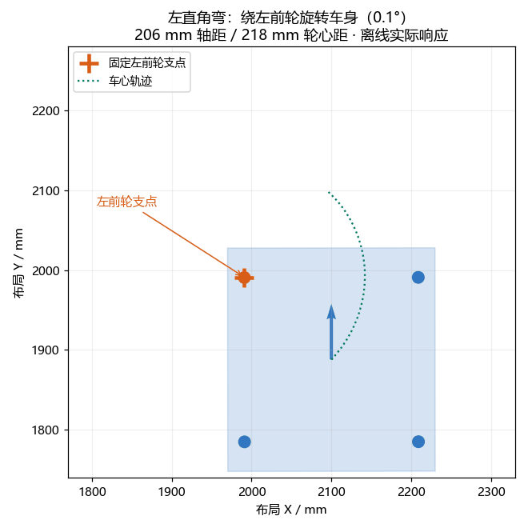
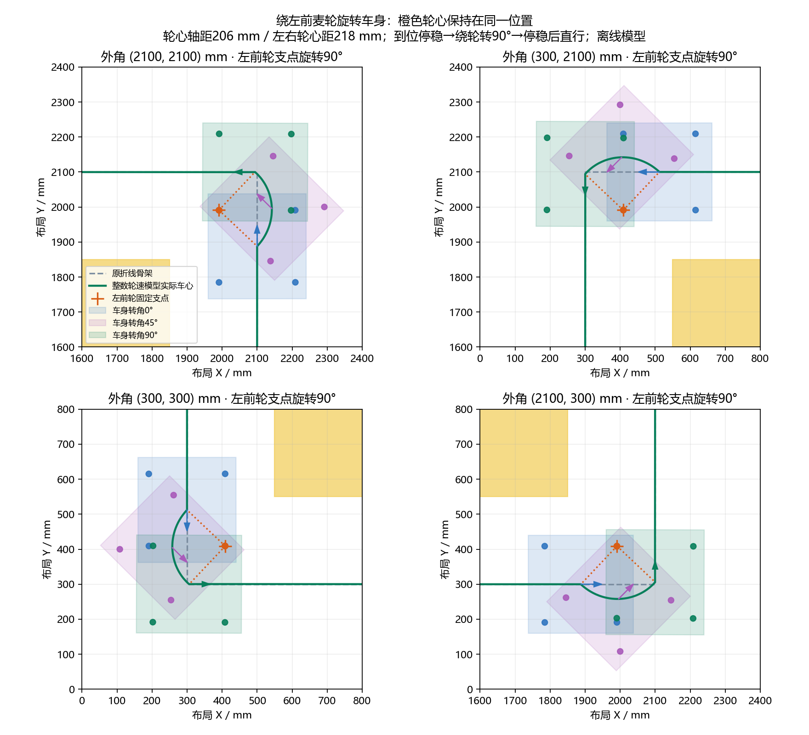

# v2.1.8 麦轮支点转弯

> 本文是 v2.1.8 进出弯停稳方案的历史记录；当前版本按用户要求改为减速衔接、过弯不等待，见 [v2.1.9 连续麦轮支点转弯](SMOOTH_WHEEL_PIVOT_TURNS_20261006.md)。

左直角弯以左前麦轮轮心的地面投影为固定支点，车身绕该支点旋转 90°；右直角弯用右前轮，倒车对应使用内侧后轮。动作顺序为 **入弯点到位停稳 → 绕指定麦轮旋转 → 出弯点停稳 → 沿新方向直行**。规划器不再用自由选择的切弯圆心/240 mm 半径替代这一动作。

## 已采用的实测尺寸

用户提供前后轴中心距 206 mm、左右轮胎最外侧间距 250 mm、单轮宽 32 mm。因此左右轮心间距取 `250−32=218 mm`，四个轮心相对底盘中心的位置为前后 ±103 mm、左右 ±109 mm。假设四轮关于底盘中心对称，OPS 位置映射的参考点对应这个中心。

| 轮心 | 车体前方向/mm | 车体左方向/mm |
| --- | --- | --- |
| FL 左前 | +103 | +109 |
| FR 右前 | +103 | −109 |
| BL 左后 | −103 | +109 |
| BR 右后 | −103 | −109 |

底盘旋转运动学臂长由原名义 270 mm 改为 `(206+218)/2=212 mm`。硬件 `mecanum_geometry.h` 与 PC `mecanum_geometry.py` 同步保存轮心尺寸，麦轮世界速度换算与坐标执行器都使用这组臂长。原 280×260 mm 碰撞矩形和地图安全裕量保留，轮心轴距不拿来缩小车体。

## 图与控制

橙色点是同一个左前轮支点。蓝、紫、绿分别表示车身转了约 0°、45°、90°，其他三个轮心随车身移动。绿色车心轨迹仍会呈圆弧，这是绕轮旋转的几何结果；其圆心绑定在指定轮心，半径约 149.97 mm，由实际轮心偏移决定，不是自由切弯半径。

控制器用实际航向计算对应车心位置，并结合位置反馈保持支点。平移前馈与角速度耦合：理想情况下指定轮心的地面速度为零；整数 RPM 和纠偏误差下允许有限偏移，不能把“轮子转速为零”当作轮心固定的充分条件。模型验证直接计算所选轮心的世界位置，而不只检查车心半径。

进出弯要求实际位置/航向到位、请求速度小于停稳门，经过 200 ms 位置/角度范围检查后才推进。严格停车带为 0.5 mm / 0.3°；停稳放行位置小于 1 mm / 航向小于 1°。角速度变化率 180°/s²，七项底盘参数、3000 RPM 限幅、整数轮速余量及已有 STOP/OPS/失联保护继续生效。

四个外角的两个方向共八条自动规划，均通过理想矩形连续扫掠、50 Hz 实际整数轮速矩形响应扫掠和末端 STOP。真实 C 加整数电机回放八条全 DONE，支点轮心最大偏移约 1.465 mm；这不是实车测量。

宽敞外角优先安全的麦轮支点方案；其他拐角只在完整模型更快时采用。支点几何不合适、扫入黄区/设备/边界/障碍、控制预演失败或预算用尽，都保留已有安全路线。没有改变安全裕量或强行指定无法容纳车体的支点。

插入支点旋转后不沿用原骨架最优性证明。额外候选预算最多 0.75 秒，仍受原总预算与取消信号约束。原横移限制继续由完整响应检查。

同一快速点击入口关闭支点旋转后与启用后的时间保存在 [八方向结果 JSON](wheel_pivot_four_corners_20261006.json)。当前八条支点模型约 8.86 s，含严格进出弯停车；本次没有提速承诺。复现：`python Docs/audit_pivot_turns_20261006.py`。

## 双端更新

需要重启 PC v2.1.8 并烧录本次 HEX。固件工程 `MDK-ARM`，配置 `STM32F407VET6_ILHC`，构建目录 `MDK-ARM/build/STM32F407VET6_ILHC`，产物 `STM32F407VET6_ILHC.hex`。

新的 `CCAPS 3 2048 3` 标识实际轮心几何和麦轮支点控制。即使普通坐标仍用旧 22 字节 CRC 点格式，新 PC 也要求 CCAPS3，避免使用 212 mm 的预演与旧 270 mm 固件混用。含支点批次在 CBEGIN 七参数后追加 `,3`，CPOINT 带两个 OPS 支点坐标，旗标 16 为固定点旋转、32 表示麦轮支点且进出弯停稳。CRC 覆盖支点坐标。

固件验证支点确实位于当前起始姿态的某个轮心，同时验证半径/端点/角度/弧长。点表仍共用 64 KiB，内部 32 字节×2048；旧密集轨迹 TCAPS1、普通坐标字段以及旧通用圆心格式接收保持兼容。新 PC 不会把支点动作降为直线；CCAPS1/2 在发送 CBEGIN/CPOINT/TRUN 前拒绝。

USART 行缓冲 128 字节，可容纳 91 字节圆心点与 106 字节七参数批次头；真实分包接收、超长整行丢弃及原接收恢复已检查。

本轮只进行了离线模型、真实 C 回放和固件编译，没有连接串口、烧录或驱动实车。

## 最终验证记录

2026-10-06 后台完整回归四组全部退出 0。结果与退出码保存在 [后台状态 JSON](wheel_pivot_background_status_20261006.json)，可用 `python Docs/run_wheel_pivot_validation_20261006.py` 复现。

| 检查 | 最终结果 | 日志 |
| --- | --- | --- |
| 核心自检与完整无界面回归 | 6 组核心、326 项通过；unittest 150.830 s | [无界面日志](wheel_pivot_headless_background_final_20261006.log) |
| 真实 Qt 全套 | 191 项通过，365.854 s | [Qt 日志](wheel_pivot_qt_background_final_20261006.log) |
| 真实 C 坐标执行 | 18 项通过，111.381 s；含八轮完整比赛及八个角向轮心旋转 | [C 坐标日志](../../../../RTOS_APP/validation/wheel-pivot-c-background-final-20261006.log) |
| 旧 C 密集轨迹与相关脚本 | 16 项通过，54.892 s；桥接、参数、RTOS、坐标链脚本通过 | [旧轨迹日志](../../../../RTOS_APP/validation/wheel-pivot-legacy-background-final-20261006.log) |
| USART 接收、发送 CRC、命令轴、RTOS | 四个脚本直接执行通过 | [串口相关日志](../../../../RTOS_APP/validation/wheel-pivot-rx-scripts-final-20261006.log) |
| EIDE 固件构建 | 0 错误、0 警告；Flash 78392 B、RAM 97064 B | [构建日志](../../../../RTOS_APP/validation/wheel-pivot-build-final-20261006/MDK-ARM-STM32F407VET6_ILHC-build.log) |

最终 HEX 生成时间为 2026-10-06 01:16:03。Python 编译与 `git diff --check` 通过。轮心专项还验证了进出弯未停稳不推进、倒车后轮选择、狭角全车体拒绝、旋转坐标映射、CRC/几何拒绝、旧固件能力拒绝、取消和预算回退。

此前自由圆心测试、初始测试失败以及两次因新消息中断的回归日志均保留作历史，不能替代本节完整最终结果。动画只画旋转阶段，来自同一整数轮速回放；支点误差数据仍是离线模型结果。
